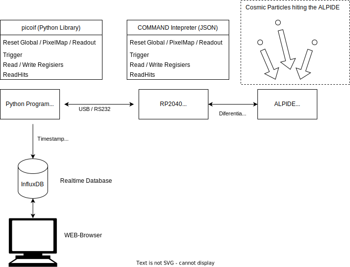

# Cosmic particle readout system overview
 
 
## Readout Hardware
 
 
Schematics and PCB layout is found inn the kicadv6 folder   \
Design files for the cover is found in the the CAD foldder 

## Project Content 
### alpideInterface
Microcontroller firmware source for [Arduino IDE 2.x](https://github.com/arduino/arduino-ide) \
&nbsp; parses JSON command and sends it to the ALPIDES \
&nbsp; More Info Available in the [README](/ArduinoV2/README.md) 

### KicadV6  
PCB Design files for [Kicadv6] (https://www.kicad.org/) \
&nbsp; More Info Available in the [README](/KicadV6/README.md) 

### CAD  
CAD Design files for PCB cover [Freecad v0.21] (https://www.freecad.org/) \
&nbsp; More Info Available in the [README](/CAD/README.md) 

### Python
Python ver 3.x Library and Examples for reading/accessing the Alpide OB Modules \
&nbsp; More Info Available in the [README](/Python/README.md)

## Getting started
- Transfer .u2f file to the RPI Pico
- Modify Serial port in plotAplideHitmap.py
  - Run [plotAplideHitmap.py](/Python/plotAplideHitmap.py) (python3 plotAplideHitmap.py )
